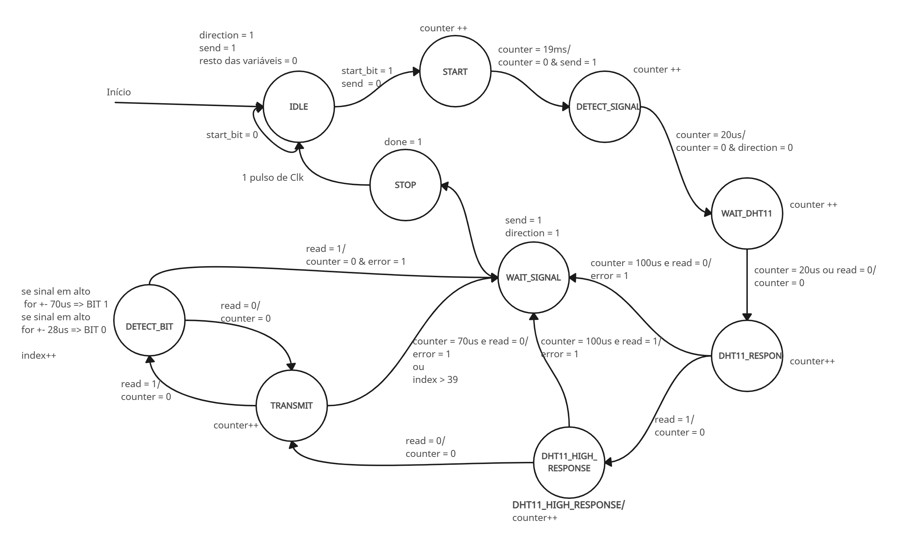
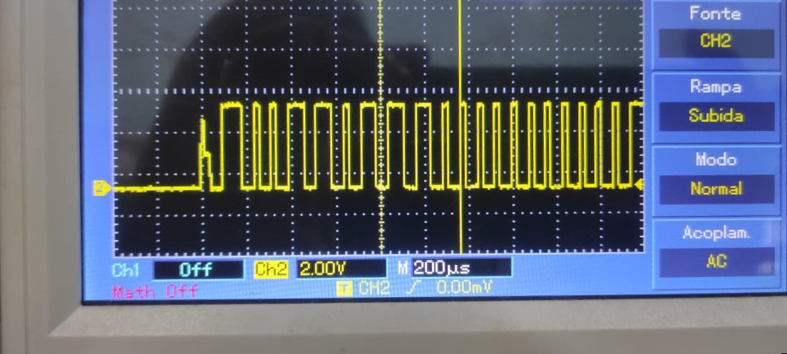
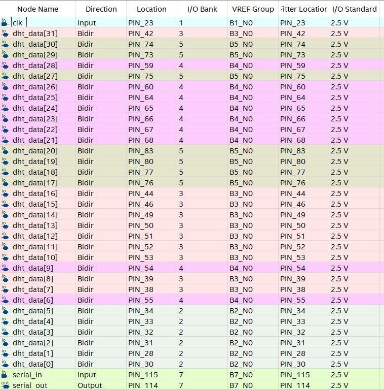

# DigitalSensorQuery
## Introdução

Com o crescimento do mercado de Internet das coisas (IOT), uma empresa visando entrar no ramo decidiu solicitar aos alunos de Engenharia da Computação da UEFS que desenvolvessem um protótipo de um sensor digital para monitoramento de ambientes. De começo o protótipo tem como objetivo a possível comunicação de forma serial entre dispositivos, logo para atender a esses requisitos foi-se necessário a utilização de um protocolo de comunicação serial conhecido como UART. A UART desempenha um papel crucial na interconexão de dispositivos eletrônicos, fornecendo uma forma eficaz de comunicação serial assíncrona. É uma tecnologia essencial para o mundo da eletrônica e é frequentemente implementada em microcontroladores, processadores e interfaces de comunicação serial em uma ampla gama de aplicações. O objetivo deste protótipo é fazer-se possível o monitoramento de até 32 sensores DHT11, o DHT11 é um sensor de umidade e temperatura que se tornou bastante popular devido à sua facilidade de uso, preço acessível e eficiência. Ele é frequentemente utilizado em projetos eletrônicos e de automação residencial para monitorar a umidade e a temperatura do ambiente. Este sensor consiste em uma placa revestida por um material higroscópico que muda sua resistência elétrica em resposta à umidade. A leitura da temperatura é realizada por meio de um termistor, um componente cuja resistência varia com a temperatura, no entando para compreender o sensor DHT11, ou seja, comunicar, receber e exibir sua resposta para o usuário, e para comunicar e receber foi-se utilizado dois terminais no linux um para transformar os dados recebidos e um para mandar o código para entrar em comunicação com o sensor DHT11. Os "terminais" no contexto do Linux referem-se à interface de linha de comando (CLI - Command Line Interface) que permite aos usuários interagirem com o sistema operacional por meio de texto e comandos. Os terminais no Linux são uma parte fundamental do ambiente, especialmente para usuários avançados, administradores de sistemas e desenvolvedores.

Para o desenvolvimento do protótipo foi utilizada a placa FPGA Cyclone IV modelo EP4CE6E22C8, esta placa representa uma importante inovação no campo da eletrônica digital. Pertencente à renomada família de FPGAs Cyclone IV da Altera, esse dispositivo oferece uma plataforma versátil e poderosa para o desenvolvimento e implementação de sistemas digitais complexos. A sigla "EP4CE6E22C8" denota suas características e capacidades específicas. Esta FPGA possui uma matriz de portas lógicas reconfiguráveis, blocos de memória integrada, PLLs (Phase-Locked Loops), e outros recursos essenciais para a implementação de sistemas digitais. O "EP4CE6E22C8" indica o número de elementos lógicos (LEs), a densidade de células lógicas, e a velocidade máxima de operação, entre outros aspectos importantes. E para desenvolvimento deste projeto de Hardware, precisamos utilizar uma linguagem de Hardware e uma ferramenta para se comunicar com o Hardware e foram elas:
   1.   O Quartus é um ambiente de desenvolvimento integrado (IDE) desenvolvido pela Altera Corporation, agora parte da Intel. Ele oferece um conjunto abrangente de ferramentas para projetar, simular, sintetizar e implementar circuitos digitais em dispositivos FPGA e CPLD. O Quartus é uma ferramenta crucial para engenheiros que desejam criar e otimizar sistemas digitais para uma ampla gama de aplicações.
   2.   O Verilog é uma linguagem de descrição de hardware usada para modelar, simular e sintetizar sistemas digitais.

Em resumo, o Verilog é uma poderosa linguagem de descrição de hardware, e o Quartus é uma ferramenta essencial para projetar, simular e implementar circuitos digitais, muitas vezes utilizando o Verilog como a linguagem de descrição de hardware. A combinação dessas duas ferramentas é central para o desenvolvimento eficiente de sistemas digitais complexos e muito importante para a programação na placa FPGA que foi o intermeio de comunicação entre os dispositivos. Com isso iremos falar mais sobre a metodologia utilizada para o desenvolvimento deste protótipo.

## Metodologia

Para desenvolvimento do sistema proposto, foram estipuladas quais seriam as ferramentas utilizadas e quais as etapas a serem seguidas. 
A nível de organização, o projeto foi dividido em partes (módulos), a fim de facilitar a manutenção, escalabilidade, testabilidade, entendimento e documentação.

As ferramentas utilizadas no desenvolvimento do projeto foram:
   - FPGA CYCLONE IV
   - Sensor(es) DHT11
   - Software Quartus
   - Editor de Texto para escrita do código em C e Terminal Linux para compilar e executar o código
   - Software Creately para modelagem do sistema e máquinas de estados

As etapas que foram seguidas em ordem cronológica, foram:
   1. Protocolo UART
      1. Estudo do funcionamento do protocolo de comunicação
      2. Desenvolvimento do Código em C responsável pela transmissão e recebimento dos dados pelo usuário
      3. Desenvolvimento do Código em Verilog da máquina de estados responsável pela UART na FPGA
      4. Desenvolvimento do gerador de Baud Rate para a comunicação serial
   2. Sensor DHT11
      1. Estudo do funcionamento do DHT11 por meio da leitura do seu datasheet
      2. Desenvolvimento da máquina de estados em Verilog capaz de acionar o sensor e coletar a temperatura e a umidade
      3. Para funcionamento desta máquina, foram desenvolvidos:
         1. Um módulo Tri State para controle do fluxo de dados entre a FPGA e o sensor (Ora a FPGA manda sinal, ora o sensor manda sinal)
         2. Um módulo de geração de Clock com periódo de 1 microssegundo, já que o tempo das respostas do sensor é baseado em microssegundos
   3. Unidade de Controle - Stepper
      1. Modelagem do módulo
      2. Desenvolvimento da máquina de estados em Verilog
   4. Ajuste de erros e testagem
      
## Descrição do Projeto:

   ### Diagrama em alto nível
   Por meio de uma interface com o computador, o sistema propõe que o usuário consiga solicitar a temperatura e umidade atual de até 32 sensores DHT11. Além de informar a temperatura/umidade em um determinado instante, o sistema é capaz de informar a temperatura/umidade de maneira continua a cada 2 segundos aproximadamente, caso o usuário queira. O diagrama em alto nível deste projeto pode ser visto logo abaixo.

   

   As requisições do usuário são enviadas serialmente para um módulo UART da placa FPGA Cyclone IV. Quando terminado o envio de todos os bits de transmissão do PC para a placa, o módulo UART envia um bit de sinal "DONE RECEIVER" para a unidade de controle da placa, chamada de Stepper, além dos bits que correspondem ao comando requistado e o endereço do sensor requisitado.  

   Após isto, a unidade de controle envia um sinal de start para o módulo DHT que, por sua vez, inicia sua comunicação com o sensor requisitado. Este módulo consegue coletar tanto a temperatura, quanto a umidade apontadas pelo sensor, e ao terminar esta coleta, envia um sinal de retorno para o Stepper, indicando o término da comunicação com o DHT11, juntamente com a temperatura e a umidade.  

   O Stepper com posse da temperatura e umidade coletada, consegue então enviar as informações requisitadas pelo o usuário. Para transmitir os dados, há a necessidade da unidade de controle enviar um sinal de início de transmissão para a UART, já que é ela a responsável pela comunicação com o computador.  

   Por fim, a UART transmite serialmente para o computador os bits contendo o valor obitido da temperatura/umidade, juntamente com o endereço do sensor requisitado e o comando de resposta.  

   ### C
   A comunicação do computador com a FPGA é feita através de um cabo serial, utilizando o protocolo UART que será detalhado na próxima seção. Essa comunicação é controlada por dois códigos em C salvos em arquivos distintos, o "read_uart.c" e o "write_uart.c"
   #### read_uart.c
   Esse arquivo serve para ler a porta serial continuamente.
   
   As principais funções são:
   
   - hexToBinString: recebe um "unsigned char" e transforma-o em uma string com 8 caracteres, cada caractere representa um bit e pode ser 0 ou 1, para realizar essa função foi utilizado o LSL (Logic Shift Left) e um comparador de bits (&) para "iterar" sobre os bits do char e ir guardando um a um na string.
      
   - binToInt: recebe a string com os 8 bits gerada na função anterior e converte em um número inteiro.
      
   - printAllSensors: printa todos os 32 sensores em uma tabela, o valor de temperatura e umidade nessa tabela é mostrado somente se o sensor estiver em modo contínuo.
      
   - printAndRunCurrentCommand: recebe o comando, endereço e valor recebidos e printa a última requisição lida.
      
   - main: na função principal existe o comando de abertura da porta serial em modo de leitura e um laço "while", que é atualizado a cada segundo e lê 3 bytes da porta  a cada atualização. Os bytes são, respectivamente, endereço, comando e valor. Ela envia os valores recebidos para as demais funções e printa informações para debug, como os valores recebidos em formato binário, inteiro e hexadecimal, e a quantidade de bytes lidos.

Os comandos recebidos são lidos e interpretados, seguindo a seguinte tabela:

   | Comando | Descrição |
| ---  | --- |
|  0x1F | Sensor Com Problema  |
|  0x07 | Sensor Ok |
|  0x09 | Medida de Temperatura |
| 0x08 | Medida de Umidade |
| 0x0C | Confirmação Ativamento Contínuo Temperatura |
|  0x0F | Confirmação Ativamento Contínuo Umidade |
|  0x1A | Confirmação Desativamento Contínuo Temperatura|
|  0x0B | Confirmação Desativamento Contínuo Umidade|
     
   #### write_uart.c
   Esse arquivo serve para escrever bytes na porta serial

   A única função presente nele é a main, onde o usuário pode digitar o endereço e o comando do pedido. Cada requisição tem o formato "XX YY" onde XX é um número inteiro de 0 a 31 representando o sensor, e YY é uma string contendo dois chars que representam o comando.
   Cada comando é convertido para o seu código binário correspondente, antes de ser enviado pela UART, seguindo a seguinte tabela:
   
   | Comando | Hexadecimal | Função |
| --- | --- | --- |
| `SS` | 0x00 | Situação do Sensor  |
| `TT` | 0x01 | Temperatura Atual |
| `UU` | 0x02 | Umidade Atual |
| `TC` | 0x03 | Ativar Temperatura Contínua |
| `UC` | 0x04 | Ativar Umidade Contínua |
| `DT` | 0x05 | Desativar Temperatura Contínua |
| `DU` | 0x06 | Desativar Umidade Contínua |

   ### UART

   A UART, ou Universal Asynchronous Receiver/Transmitter, é um componente vital na comunicação entre dispositivos microcontroladores. Ela permite a transmissão e recepção de dados de forma assíncrona, sem a necessidade de um sinal de clock compartilhado entre os dispositivos.

   O transmissor UART é responsável por enviar os dados do dispositivo de origem para o destino. Funciona enviando os dados em pacotes, iniciando com um bit de início (start bit) para sincronização. Os bits de dados são transmitidos, geralmente, com o menos significativo primeiro. Opcionalmente, um bit de paridade pode ser incluído para detecção de erros. Por fim, um ou mais bits de parada são anexados para indicar o fim da transmissão.

   O receptor UART no dispositivo de destino decodifica os dados recebidos. Ele aguarda o início de um pacote detectando o bit de início, e lê os bits de dados conforme são recebidos. Se a paridade for utilizada, o receptor verifica se o número de bits de dados recebidos está correto. Ao identificar os bits de parada, determina o fim da transmissão e decodifica os bits de volta aos dados originais.

   Para o projeto, foi desenvolvido um módulo em Verilog capaz de se comunicar com o PC, recebendo comandos de requisições e enviando comandos de respostas, seguindo o protocolo UART. O módulo é dividido em duas partes: a UART Rx (Receptor UART) e  UART Tx (Transmissor UART). O receptor UART é résponsável por receber 2 bytes, um do endereço do sensor requisitdo e um do comando escolhido pelo usuário. Já o transmissor UART é responsável por enviar 3 bytes para o computador, um byte para o endereço do sensor que foi monitorado, um byte para comando de resposta e um byte para o valor obtido da temperatura ou umidade.

   ### DHT11
   Para desenvolvimento da máquina responsável pela comunicação com os sensosres DHT11, foi feita a leitura do datasheet que pode ser acessado nesse link: [Datasheet DHT11](public/DHT11-Technical-Data-Sheet.pdf). A comunicação entre o sensor e a FPGA é feita pelo pino chamado DATA, que é um barramento único de entrada e saída de dados - por um momento o sensor que recebe sinais da FPGA e depois de um tempo, o sensor que envia sinais para a FPGA. Devido a esta alternância do fluxo de dados, foi desenvolvido um módulo em Verilog chamado de TriState. Nele há uma variável binária "direction" que quando é 0, o sentido da transmissão de dados é do DHT11 para a FPGA, e quando é 1, o sentindo alterna.

  O processo de comunicação entre a placa e o sensor é feito por sinais digitais, ora o sinal está em alta (1), ora está em baixa (0), e o tempo de duração do sinal em um determinado nível dura em geral microssegundos. Por este motivo, foi desenvolvido um módulo gerador de microssegundo, que pega o clock da FPGA (50 MHz) e gera um clock de 1 MHz (1 microssegundo).

  O diagrama da máquina de estados desenvolvida em Verilog para a comunicação com o sensor pode ser vista logo abaixo. Inicialmente a máquina começa no estado de espera (IDLE), isto é, esperando que a unidade de controle avise que a comunicação com aquele sensor possa começar. Direction = 1 indica que é a FPGA que envia sinal para o sensor, e send = 1 indica que o sinal que está sendo enviado para o sensor é 1. Quando a unidade de controle avisa que a transmissão começou (start_bit = 1), a máquina passa para o próximo estado, Start, enviando 0 para o sensor por 19 ms. Passado este tempo, a máquina vai para o próximo estado, Detect_signal, onde a FPGA envia 1 para o sensor por 20 microssegundos. A partir dai, o fluxo da transmissão dos dados é alternado (sensor --> FPGA) e é esperada a resposta do sensor. Quando o sensor responde, a máquina alterna para o estado DHT11_RESPONSE. É esperado que o sensor fique nesse estado enquanto estiver enviando 0 para a FPGA por até 100 microssegundos. Se passar deste tempo e não houve mudnça de nível lógico para 1, ocorreu um erro na comunicação e a máquina vai para WAIT_SIGNAL. Senão, a máquina pode prosseguir. O próximo estado realiza a mesma coisa do anterior, só que agora o sensor está enviando 1 para FPGA. 
  
  Se até ai, tudo acontecer como o esperado, a máquina inicia o processo de transmissão e identificação dos 40 bits que correspodem a umidade e temperatura. O DHT11 envia um sinal em nível baixo por aproximadamente 50 microssegundos e depois sobe o sinal para 1. A extensão do sinal em nível alto determina qual o bit que está sendo enviado, se for por aproximadamente 30 microssegundos é o bit 0, se for por aproximadamente 70 microssegundos é o bit 1. Esse processo de identificar o bit é feito para cada um dos 40 bits. Após a conclusão da comunicação, a máquina vai para o WAIT_SIGNAL, onde o direction e send retornam para seu valor inicial (1) e onde visto se houve erro no processo de comunicação com o sensor ou não. Realizada tal etapa, a máquina vai para o estado de STOP, sendo enviado para a unidade de controle um sinal de conclusão da comunicação.

  ### STEPPER
   

   O módulo Stepper serve para escalonar as requisições que vêm do computador com as requisições contínuas dos 32 sensores. Existem 5 estados na máquina, sendo eles:

   - SendingConstTemp: é o primeiro estado da máquina, nele é verificado se um dos 32 sensores está em monitoramento contínuo de temperatura, caso esteja, a máquina irá para o ActivateDht e logo em seguida ao ActivateUart, caso contrário, ela passa para o próximo estado.
   - SendindConstHum: segue a mesma lógica do anterior, porém verificando a umidade constante.
   - GettingNewCommand: nesse estado, é verificado se existe algum comando que veio do computador salvo na "memória", caso exista, o comando é executado (no ActivateDht e ActivateUart), e logo em seguida a máquina volta para o primeiro estado.
   - ActivateDht: aqui a máquina do DHT11 recebe um bit de início, o estado espera até que ela envie o bit de término, para então ir para o próximo estado.
   - ActivateUart: aqui a máquina da UART é ativada para enviar o comando de resposta, além do endereço do sensor requisitado e o valor pedido. Nesse estado existe um contador de 2 segundos, pois a máquina do DHT11 precisa desse tempo para receber um novo comando.

## Resultados e análise dos testes

Durante o processo de teste, o projeto enfrentou diversos desafios, os quais foram essenciais para aprimorá-lo. Esses testes incluíram simulações no próprio Quartus, abrangendo aspectos dos módulos como o DHT e a UART. No entanto, para além das simulções no software, algumas outras simulações foram realizadas com auxílio de oscilosópio e das interfaces da própria placa FPGA.

Estes últimos foram conduzidos com o objetivo de avaliar praticamente cada módulo de forma independente. Por exemplo, o sensor DHT11 foi integrado a um único botão com pulso para minimizar ruídos. O botão foi utilizado para dar início a comunicação com o sensor - quando pressionado, o sensor era ativado. Em seguida, utilizando um osciloscópio, foi verificado se o sensor realmente respondeu corretamente, observando as ondas geradas (Figura abaixo). Por sua vez, o código C foi criado e testado em conjunto com o módulo UART, como forma de observar se os dados mandados pela FPGA, assim como os recebidos, estavam de acordo com os valores passados manualmente.

Ao final, foi realizado um teste completo do projeto em conjunto para validar se as respostas estavam de acordo com as expectativas iniciais. Essa validação foi feita através do código C, que foi elaborado especificamente para receber e enviar dados pela UART via porta serial. 

Como resultado final, o projeto utilizou cerca de 770 LEs (Logical Elements) da FPGA Cyclone IV, isto é, usou menos de 1/6 das LEs disponíveis. Além disso, foram utilizados 35 pinos de entrada e saída da placa, sendo que 32 destes pinos foram alocados para os sensores de temperatura e umidade. Abaixo seguem as imagens que correspondem a contagem de pinos, LEs usadas e a pinagem na placa Cyclone IV.

## Conclusão

Conclui-se que o projeto atendeu a todos os seus requisitos, tendo em vista que o objetivo principal do projeto é a comunicação entre os dispositivos por meio da utilização do protocolo UART visto anteriormente, o monitoramento de até 32 sensores e a exibição das informações por meio de um programa escrito na linguagem C. No entanto algumas melhorias são sugeridas, no que diz respeito a otimização de tempo de resposta dos sensores e no que tange à simplificação do código, desenvolvendo mais módulos, porém menores e de fácil entendimento.

## Autores

- José Gabriel de Almeida Pontes
- Luis Guilherme Nunes Lima
- Pedro Mendes
- Thiago Pinto Pereira Sena
